##############
Design History
##############

.. contents::
    :depth: 1
    :local:

---------------

04 May 2020
-----------

Establish the project objectives and requirements. The aim is create a single-page dashboard which can be used
to display COVID-19 testing data. That data will be provided by the Lacewing point of care diagnostic device
(pictured below).

The page should allow users to gain information on the spread of the virus and the extent to which testing is being
carried out. The target audience has not yet been decided upon with clinicians, governments and the general population
being possibilities.

The project should be implemented using the Django web-framework on the server side. This framework will be used
to create the database models, serve static files to clients and possibly implement web APIs or do data processing.

.. figure:: pictures/20200413_121845.jpg

   Lacewing point of care device (Centre for Bio-Inspired Technology)

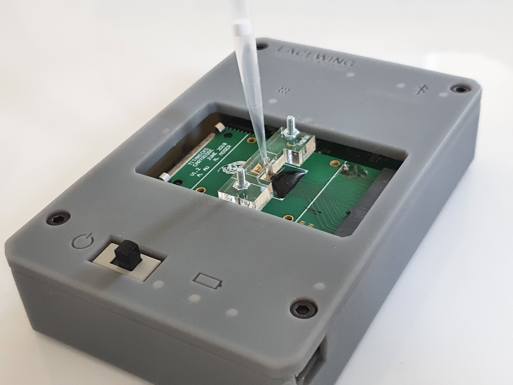

   Lacewing device with sample (Centre for Bio-Inspired Technology)

---------------

05 May 2020
-----------

The diagnostic data must be stored in a database.

Brainstorming session to determine what attributes the database schema should have and how to design it.
Two main options were considered:

* Use one table where each tuple has all the information related to the diagnostic, the patient and the testing
  location. This has the advantage of making accessing data straightforward but does have several considerable
  drawbacks. There is no separation between confidential patient data and publicly available location data. Furthermore,
  if a patient has several tests, or several tests are held at the same location, which is highly likely, there would
  be redundant information being stored in the database.

* Use three separate tables. One for patient information, one for diagnostic information and one for testing location
  related fields. There are one-to-many relationships between the ``Patient`` table and the ``Diagnostic`` table, and
  between the ``Testing_centre`` and ``Diagnostic`` tables. This resolves the issues present in the previous schema.
  Patient data is held in a separate table from all other data. The ``Diagnostic`` table has information which can
  be displayed openly as the only link to a patient is an anonymised patient ID. Having separate tables also means less
  data needs ot be stored in cases where a patient has had several diagnostics or when a testing centre is used several
  times.

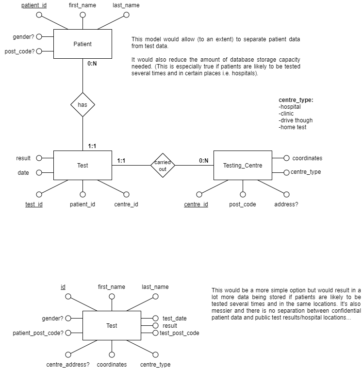

   Database schema possibilities with advantages and drawbacks

---------------

.. _query-function:

06 May 2020
-----------

Start working on the back-end implementation. An django application named ``dashboard`` is added to the ``protondx``
project. The datatable models are created based on the three-table schema described previously.

Work starts on functions which can be used to query the database to obtain general diagnostic information such as
the total number of tests, the number of positive tests and the number of different patients tested.

An administrator interface is added for the ``dashboard`` app based upon Django's 'automatic admin interface'.

---------------

07 May 2020
-----------

An initial layout for the dashboard front-end is created (pictured below). The map is implemented using the ArcGIS
API for Javascript. Basic widgets are added for zoom, search, view reset...

The dot density renderer is considered as a possible option for representing the spread of the virus or the extent of
testing in the UK.

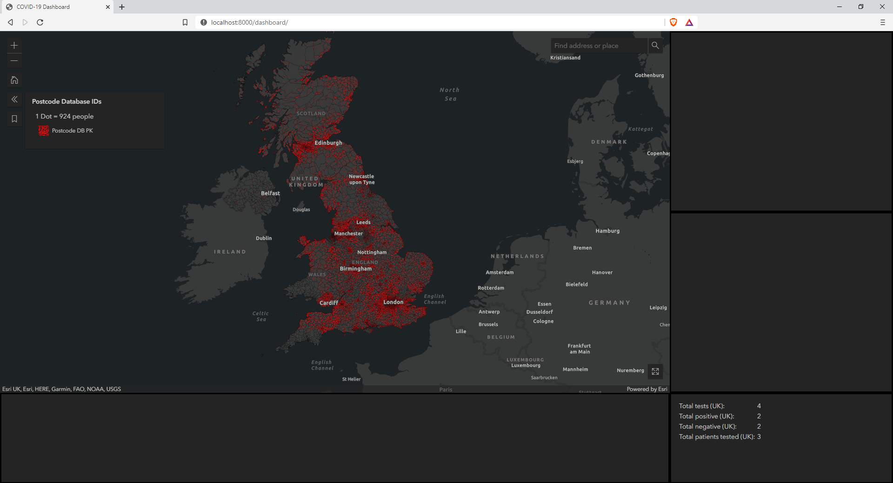

   Initial dashboard layout

---------------

08 May 2020
-----------

Radio buttons are added to select between two renderers:

* Dot density renderer: randomly placed dots inside a geographic region based on the number of tests in that region.
* Dot renderer: individual dots for each diagnostic.

At this point, the data being plotted is not obtained from the database and is just based on pseudo-random numbers.

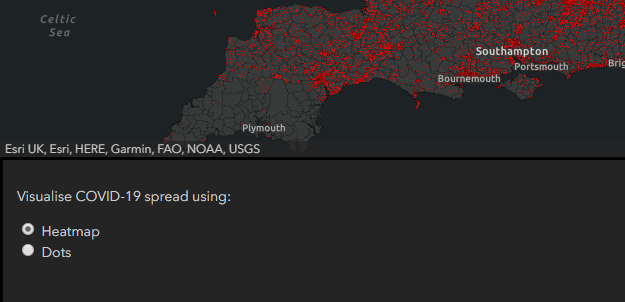

   Renderer selection (Old dashboard layout)

---------------

09 May 2020
-----------
The query functions designed on :ref:`query-function` are used to display data from the database in a popup when a
postcode sector is clicked. The postcode data is hosted by ArcGIS. On click, that postcode is sent to the server which
queries the database and returns statistics for that postcode.

---------------

10 May 2020 - 11 May 2020
-------------------------

Edit the database schema to store coordinates as a point and not separate longitude and latitude.

For example:

.. code-block::

    SRID=4326;POINT(-123.365556 48.428611)

as opposed to:

.. code-block::

    longitude = -123.365556
    latitude = 48.428611

Storing the coordinates in this manner allows us to keep track of what spatial reference system is being used and
to use the data directly with geo-spatial libraries.

The dot density renderer is replaced by a heatmap. This allows us to only need coordinates when plotting data. We don't
need to query the database separately for the data displayed by the dot renderer and the heatmaps.
The dot density renderer needed the database to be queried for each geographical region displayed on the map.

A toggle option is added which allows users to not display postcode boundaries. This allows a user to reduce the
amount of data loaded when the page is accessed. It also reduces the computational load on the client machine.

---------------

.. _12-05-2020:

12 May 2020
-----------

The dashboard layout is changed to include a table on the right side. The idea is to display information in a way where
it can easily be sorted or aggregated.

**Issue:** The data loaded in the map and table do not use the same format. All the data therefore needs to be
loaded twice using different formats. This impacts loading speeds and data usage for the client. It also affects the
server as the data needs to be serialised twice. **Unresolved**

**Issue:** Unable to serialise data in tables linked by a foreign key when the table contains geographical data such as
points (used for coordinates) and polygons.

**Temporary solution:** Combine ``testing_centre`` model with ``diagnostic_test`` model to avoid serialisation issues.

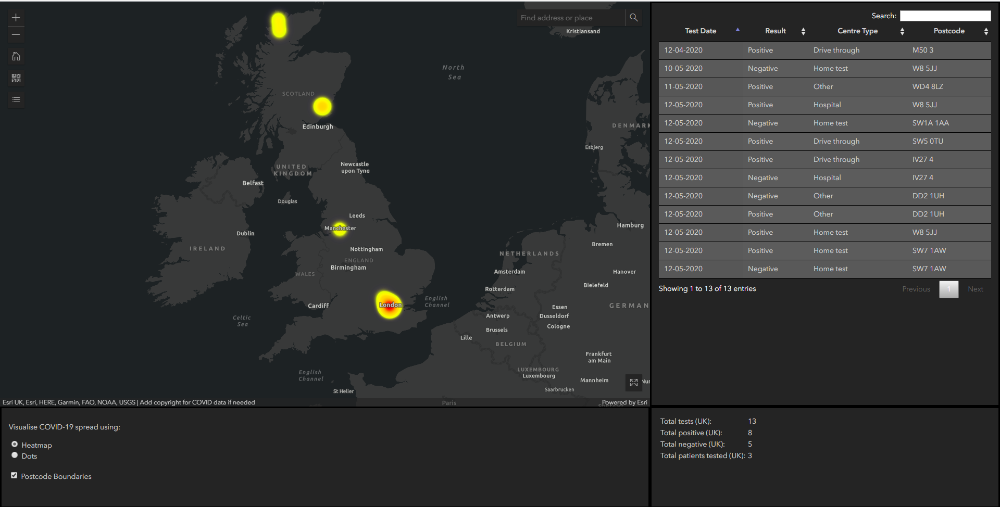

   Add table to initial design

---------------

13 May 2020
-----------
Add a feature where selecting data in the table highlights it on the map and zooms onto that point.

**Fix:** Issue where data is loaded twice is resolved by using a `Javascript blob <https://javascript.info/blob>`_ and
serialising data into GeoJSON which can be used for both the table and map.

**Fix:** The temporary solution described on :ref:`12-05-2020` is replaced by a more definitive one. The
``testing_centre`` and ``diagnostic_test`` models are separated again. A custom GeoJSON serialiser is written to
serialise data into a GeoJSON format, even when there are some columns linked to by a foreign key.

---------------

14 May 2020
-----------
The dot renderer now displays positive and negative diagnostics using different colours:

* Green: Negative - patient does not have the virus
* Red: Positive - patient has the virus
* Orange: Data not available or inconclusive

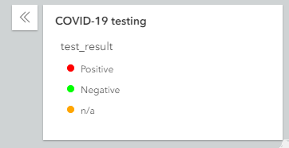

   Differentiate between positive and negative diagnostics

---------------

15 May 2020
-----------
An error message is added for cases when the dashboard is accessed from a web-browser which does not have support for
WebGL. WebGL is a JavaScript API which is used by ArcGIS to render the map.

---------------

16 May 2020
-----------
The dashboard layout is edited for the map to take up the full height of the screen on the left side.
The radio buttons and other features which were displayed on the bottom-left are now displayed in collapsible menus,
directly on the map.

Searching for an address or location now shows general statistics for the nearest postcode sector (number of tests,
number of cases, number of patients...). This search also filters the data in the table.

**Issue:** This search works at anything lower thant postcode level but is an issue when a user searches for a country,
for example. The postcode closest to the centroid of the country will be selected which is not desired.

**Solution (implemented later on):** Drop a pin on the map at the desired location. The user can then select the
location manually. If the user is zoomed out, the country layer will be selected, when further in then the region layer
is selected and if even further in, the postcode layer.

---------------

17 May 2020 - 18 May 2020
-------------------------
Functions are written to create sample data. They can be used to create any number of diagnostic test objects but there
are a limited number of different patient and testing centre objects which can be created.

A wider range of sample data is created on :ref:`03-06-2020`.

---------------

19 May 2020
-----------
Based on meetings with the team, the decision is made to add another page to the website. The aim is to have a page
where data can easily be uploaded.

The requirements as described by the team are:

* Drag and drop interface
* Extract .zip archives and display data
* Data needs to be visible to the uploader and it must be able to be be edited
* On upload data gets added to the database

The initial design is pictured below. The page is composed of an upload area (top left), data can either be dragged
into that area or selected using the client computers file explorer.
An list area which displays all the files which have been selected (bottom left). It also acts as a way to select which
file is to be displayed.
A display area (right) which shows the contents of the zip archive.

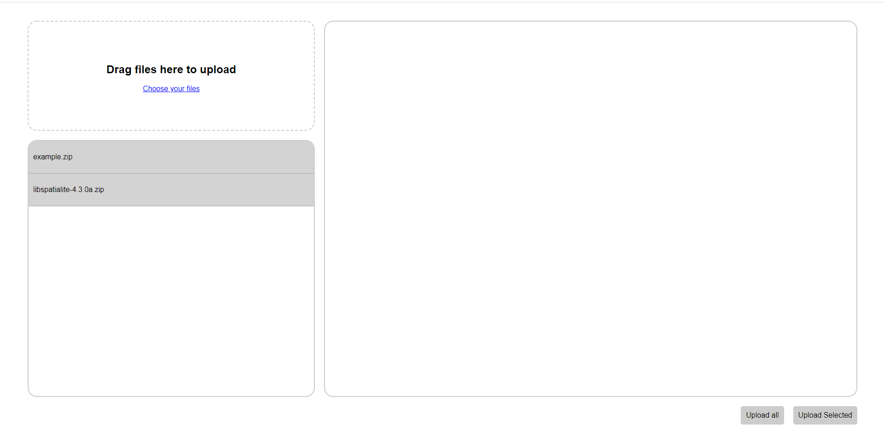

   Initial layout for file upload view

---------------

20 May 2020
-----------
Files uploaded through the upload page are opened. A basic form is created for each archive which contains a .json file.
There is a form entry for each key in the JSON object.

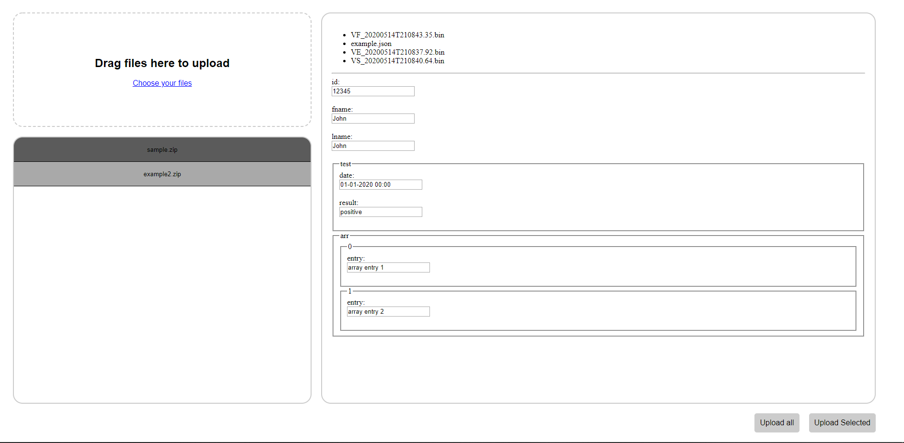

   Form created based on .json file content

---------------

21 May 2020
-----------
A new layer is added to the map. The layer shows country borders and is only visible when the user is zoomed out.
Upon selection of a country, the database is queried for statistics. This requires the country to be stored in the
database along with the coordinates.

---------------

22 May 2020
-----------
"Add charts for centre type (chart.js) and gender
consider the addition of a time slider (date format is majot obstacle)
remove datatable and have global stats instead
add a regions layer"

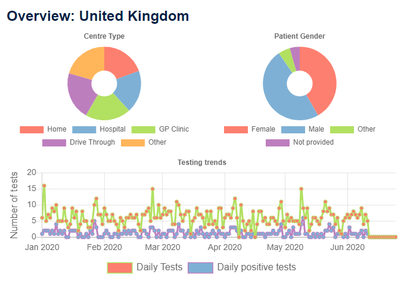

   Graphs and charts implemented using Chart.js

---------------

23 May 2020
-----------
Start transition to an imperial theme (on request from supervisor)

.. figure:: pictures/dashboard.PNG

   Revised theme on the dashboard

---------------

24 May 2020
-----------
"Datatable is added back, clicking on an entry brings up a modal (to be used for patient information)
float divs to grid"

---------------

25 May 2020
-----------
"Add: various location fileds to testing centre model (region, county, country...)
add patient info and history to modal"

---------------

26 May 2020
-----------
Refactor repo, to sperate into js, css, ... static files

---------------

27 May 2020
-----------
Form has  a defualt format and fileds are completed based on data in file

---------------

28 May 2020
-----------
"Style form
Store country data in database. use it for reverse geocoding. Use postcode API to get county and postcode"

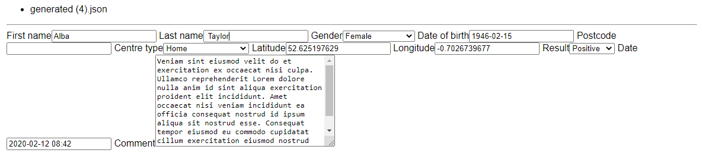

   Original form

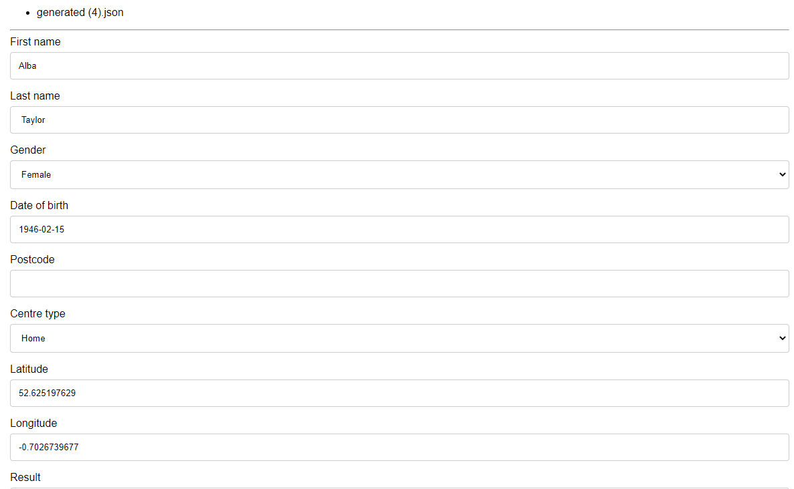

   Updated form styling

---------------

29 May 2020
-----------
"Imperial theme on upload page
date chart in dashboard"

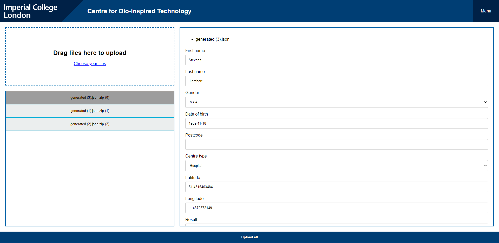

   Revised theme on upload page

---------------

30 May 2020 - 01 June 2020
--------------------------
Change all code documentation/commetns to restructured text doctrings

.. code-block:: python
    :caption: Document code using reStructuredText docstrings
    :name: docstring-comments

    def get_postcode_total_experiments(postcode):
        """
        Get the number of diagnostic tests made in a certain postcode

        :param string postcode: postcode
        :return: Number of diagnostic tests
        :rtype: int
        """
        return DiagnosticTest.objects.filter(testing_centre__postcode__startswith=postcode).count()

.. code-block:: python
    :caption: Document code using standard Python comments
    :name: standard-comments

    # Get the number of diagnostic tests made in a certain postcode
    def get_postcode_total_experiments(postcode):
        return DiagnosticTest.objects.filter(testing_centre__postcode__startswith=postcode).count()

---------------

02 June 2020
------------
Create the basic structure for documentation using Sphinx

`Sphinx <https://www.sphinx-doc.org/>`_

---------------

.. _03-06-2020:

03 June 2020
------------
Create patient sample data, add a command to import to DB

:ref:`import-command`

---------------

04 June 2020
------------
Command to load region/country.. boundaries

---------------

05 June 2020 - 11 June 2020
---------------------------
Work on deploying to AWS and later to Heroku

:ref:`deploy-guide`

---------------

12 June 2020
------------
"Compress static files and all data over 200B transferred using GZIP
add login/logout for doctors"

---------------

13 June 2020
------------
"log user who uplaods data
integrate PCR data generation/querying into REST API"

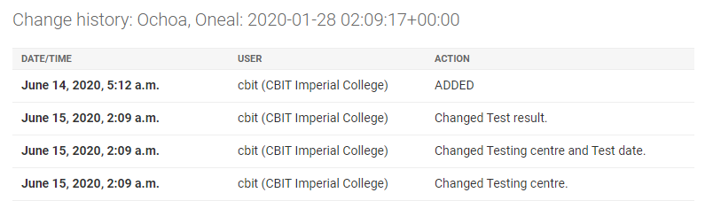

   Audit log

---------------

14 June 2020 - 17 June 2020
---------------------------
Add time slider for the dot renderer (seperate branch)

---------------

18 June 2020 - 25 June 2020
---------------------------
document the project based on noted taken throughout

