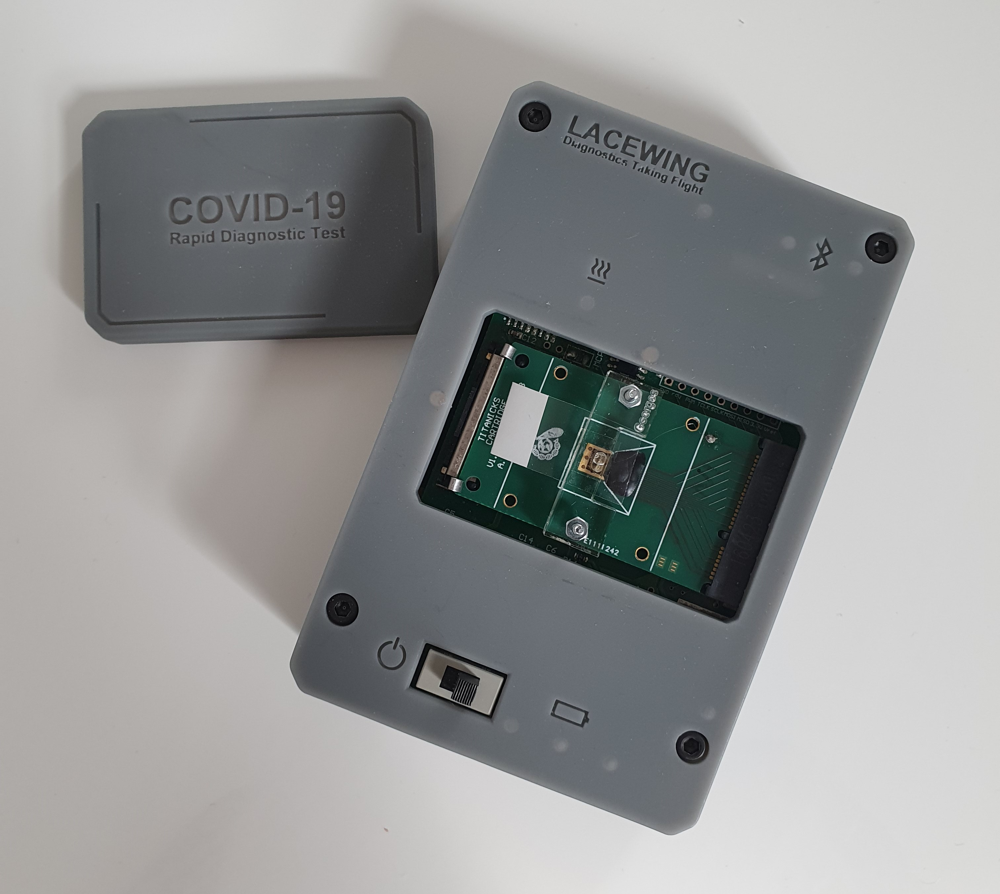

##############
Design History
##############

.. contents::
    :depth: 1
    :local:

---------------

04 May 2020
-----------
"Goal: design a webpage to display COVID-19 testing and diagnosis data
Data is obtained from the Lacewing POC diagnostic device."

   Lacewing point of care device (Centre for Bio-Inspired Technology)

   Lacewing with sample (Centre for Bio-Inspired Technology)

---------------

05 May 2020
-----------
Consider different database schemas

.. figure:: pictures/DB_ER_diagram.png

   Database schema possibilities with advantages and drawbacks

---------------

06 May 2020
-----------
"Create Dashboard django application
Use DB schema to design models
3 tables
Fn to query database and get statistics (start)
start of administrator interface for dashboard app"

---------------

07 May 2020
-----------
"Possible dashboard layout
add map with dot density renderer (no actual data or geographical data in use)
add widgets to map (zoom, search, extent reset)"

.. figure:: pictures/dash-1.PNG

   Initial dashboard layout

---------------

08 May 2020
-----------
"add radio buttons to select what rendere is used (density vs dots)
add popup on postcode select (no data)"

.. figure:: pictures/old-render-select-1.PNG

   Renderer selection (Old dashboard layout)

---------------

09 May 2020
-----------
use query Fns (6 may) to add data to popup - use django rest api

---------------

10 May 2020 - 11 May 2020
-------------------------
"Add: Pointfield (for coordinates) to testing centre model
Replace dot-density renderer with heatmap, allows us to not need fixed boundaries / data for each region, we can use just coordiantes
add toggle for postcode layer: reduce data usage"

---------------

12 May 2020
-----------
"add a table along whole left side using datatables
issue : data need sto be loaded twice due to format issues
Combine testing centre model with diagnostic test to avoid serialisation issues"

   Add table to initial design

---------------

13 May 2020
-----------
"Selection in table highlights diagnostic on map
fix the data laoded twice issue by using a glob to make it seem as if the laoded data was data which can be queried with a link
write custom geoJSON serializer which works with foreign keys, centre model can be added back"

---------------

14 May 2020
-----------
Add colour sensitive dot renderer (diff colour for pos and neg diagnostics)

   Differentiate between positive and negative diagnostics

---------------

15 May 2020
-----------
Add error msg for cases when WebGL is not enabled

---------------

16 May 2020
-----------
"Edit dashboard layout
seraching for address gives overview data for closest postcode (removed later on)
search in map filters the datatable"

---------------

17 May 2020 - 18 May 2020
-------------------------
Write functions to create sample data (very basic, limited centres/patients)

---------------

19 May 2020
-----------
Start file upload app

.. figure:: pictures/upload-page-old-1.PNG

   Initial layout for file upload view

---------------

20 May 2020
-----------
Open uploaded files, try and create a form based on json content

.. figure:: pictures/upload-page-old-2.PNG

   Form created based on .json file content

---------------

21 May 2020
-----------
Add a country GeoJSON layer + get basic statistics for the country

---------------

22 May 2020
-----------
"Add charts for centre type (chart.js) and gender
consider the addition of a time slider (date format is majot obstacle)
remove datatable and have global stats instead
add a regions layer"

   Graphs and charts implemented using Chart.js

---------------

23 May 2020
-----------
Start transition to an imperial theme (on request from supervisor)

.. figure:: pictures/dashboard.PNG

   Revised theme on the dashboard

---------------

24 May 2020
-----------
"Datatable is added back, clicking on an entry brings up a modal (to be used for patient information)
float divs to grid"

---------------

25 May 2020
-----------
"Add: various location fileds to testing centre model (region, county, country...)
add patient info and history to modal"

---------------

26 May 2020
-----------
Refactor repo, to sperate into js, css, ... static files

---------------

27 May 2020
-----------
Form has  a defualt format and fileds are completed based on data in file

---------------

28 May 2020
-----------
"Style form
Store country data in database. use it for reverse geocoding. Use postcode API to get county and postcode"

.. figure:: pictures/old-form.PNG

   Original form

.. figure:: pictures/form-new.PNG

   Updated form styling

---------------

29 May 2020
-----------
"Imperial theme on upload page
date chart in dashboard"

   Revised theme on upload page

---------------

30 May 2020 - 01 June 2020
--------------------------
Change all code documentation/commetns to restructured text doctrings

.. code-block:: python
    :caption: Document code using reStructuredText docstrings
    :name: docstring-comments

    def get_postcode_total_experiments(postcode):
        """
        Get the number of diagnostic tests made in a certain postcode

        :param string postcode: postcode
        :return: Number of diagnostic tests
        :rtype: int
        """
        return DiagnosticTest.objects.filter(testing_centre__postcode__startswith=postcode).count()

.. code-block:: python
    :caption: Document code using standard Python comments
    :name: standard-comments

    # Get the number of diagnostic tests made in a certain postcode
    def get_postcode_total_experiments(postcode):
        return DiagnosticTest.objects.filter(testing_centre__postcode__startswith=postcode).count()

---------------

02 June 2020
------------
Create the basic structure for documentation using Sphinx

`Sphinx <https://www.sphinx-doc.org/>`_

---------------

03 June 2020
------------
Create patient sample data, add a command to import to DB

:ref:`import-command`

---------------

04 June 2020
------------
Command to load region/country.. boundaries

---------------

05 June 2020 - 11 June 2020
---------------------------
Work on deploying to AWS and later to Heroku

:ref:`deploy-guide`

---------------

12 June 2020
------------
"Compress static files and all data over 200B transferred using GZIP
add login/logout for doctors"

---------------

13 June 2020
------------
"log user who uplaods data
integrate PCR data generation/querying into REST API"

   Audit log

---------------

14 June 2020 - 17 June 2020
---------------------------
Add time slider for the dot renderer (seperate branch)

---------------

18 June 2020 - 25 June 2020
---------------------------
document the project based on noted taken throughout

